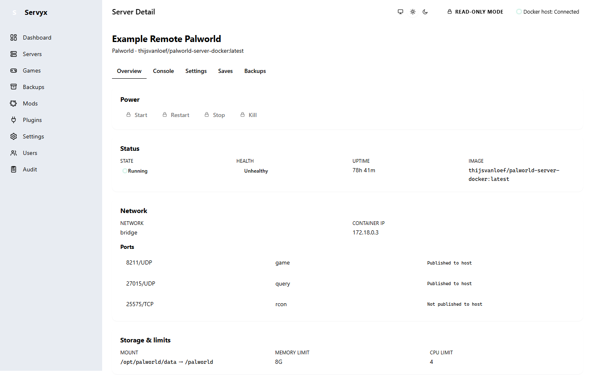
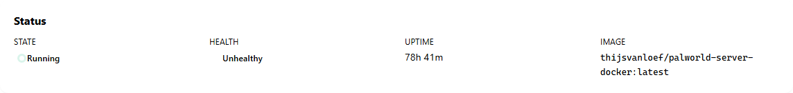

# Adopting a remote host

Servyx's headline capability is watching a game server that runs on a machine you never log into directly — a box reachable only over SSH, running Docker, somewhere that is not the machine Servyx itself is running on. This is the `ssh+docker` transport: Servyx opens an SSH session to the remote host and drives the `docker` CLI over it, the same way you would by hand, but read-only and continuously.


## Declaring a remote host

A remote host is declared in configuration, under `Servyx:Hosts:<name>`, where `<name>` is a label you choose for it:

```json
{
  "Servyx": {
    "Hosts": {
      "my-remote-box": {
        "Enabled": true,
        "Transport": "ssh+docker",
        "Endpoint": "ssh:user@<REMOTE_HOST>:22",
        "CredentialUrn": "secret://connector/my-remote-box/ssh/private-key",
        "TrustPolicy": "requirePinned",
        "PinnedFingerprints": "SHA256:REPLACE_ME",
        "Container": "palworld-server"
      }
    }
  }
}
```

| Field | Meaning |
|---|---|
| `Enabled` | Must be an explicit, parseable `true`. Missing, empty, or unparseable is treated as a misconfiguration and logged — it does not silently default to on or off. |
| `Transport` | Optional; when present it must be `ssh+docker` for this host to be picked up at all. Leaving it unset also works — it exists so this same section can later host other, non-Docker host kinds without them being misread as `ssh+docker` entries. |
| `Endpoint` | `ssh:user@host:port` — the `ssh:` prefix and the port are both optional; a bare `host` defaults to port 22. |
| `CredentialUrn` | A `secret://{scope}/{scopeId}/{category}/{name}` locator for the SSH private key (see [Getting the key into the secret store](#getting-the-key-into-the-secret-store) below). It names *where* the credential lives — never the credential itself. |
| `TrustPolicy` | `requirePinned` (the default if omitted) or `trustOnFirstUse`. See [Host-key pinning](#host-key-pinning-fails-closed) — in practice this field rarely matters, because `PinnedFingerprints` below, when set, is checked first regardless of what this says. |
| `PinnedFingerprints` | A comma-separated list of `SHA256:...` fingerprints. If set, this is compared directly against the key the host presents on every connection attempt, ahead of anything else. |
| `Container` | The name of the container on that host Servyx should observe. Required. |

## Only the first configured host is wired

**Only `Servyx:Hosts[0]` is currently connected to anything.** You can declare more than one host under `Servyx:Hosts`, and every entry that parses correctly is accepted and validated — but the running dashboard has exactly one slot for a remote, `ssh+docker`-observed server, and only the first configured host fills it. A second (or third) configured host is accepted, not rejected, but is not wired to anything: it will not appear in the server list, and Servyx logs a warning at startup naming it and saying so plainly. This is a genuine limitation of the current milestone, not a bug to work around — if you need to watch more than one remote box, that support does not exist yet.

## Host-key pinning fails closed

Before Servyx runs a single command against a remote host, it verifies the SSH host key the box presents. This check is enforced structurally, not as a step someone can forget: SSH.NET's own connection handshake is wired to abort unless the verifier reports the key as **Trusted** — no exec session, no file-read session, nothing is ever constructed for any other outcome (unknown host, changed key, or explicitly revoked key). There is no configuration path that skips this.

A key becomes Trusted one of two ways:

- **`PinnedFingerprints` matches directly.** If you set this field, Servyx compares the presented key's SHA-256 fingerprint against your list on every connection, and nothing else is consulted. This is the most explicit, most auditable option, and the one shown in the example above.
- **The key was already pinned in Servyx's persisted host-key store** (`servyx-data/host-keys.json` by default — see [Connecting a host](connecting-a-host.md)), from an earlier trust-on-first-use confirmation.

Absent either of those, the verdict is `Unknown` — never `Trusted` — and the connection is refused outright. There is no "accept any key" setting anywhere in Servyx; that is intentional (see [Connecting a host](connecting-a-host.md) for why).

### Obtaining a fingerprint

To fill in `PinnedFingerprints` correctly, get the fingerprint from a source you trust independently of Servyx — never invent one or copy one from an untrusted channel. One straightforward way: connect to the host once with a plain `ssh` client, confirming the key you're shown against your host provider's console or a fingerprint you saved when you built the box, then read it back out of your local `known_hosts`:

```bash
ssh-keygen -F <REMOTE_HOST> -l
```

This prints the SHA-256 fingerprint of whatever key is on record for `<REMOTE_HOST>` in your `known_hosts` file. Paste that value — the whole `SHA256:...` string — into `PinnedFingerprints`.

## Getting the key into the secret store

`CredentialUrn` only *names* a secret; it does not carry one. Servyx's own secret store is where the actual private-key bytes have to end up before a connection can use them, and the supported way to get a key in is a config-driven, startup-only import: `Servyx:Secrets:Import`.

```json
{
  "Servyx": {
    "Secrets": {
      "Import": {
        "secret://connector/my-remote-box/ssh/private-key": "/path/to/plaintext-key-file"
      }
    }
  }
}
```

Each entry maps a `secret://...` URN to a file path. On startup, Servyx reads that file's bytes exactly as they are — no trimming, no encoding changes, since a private key is whitespace- and newline-sensitive — and writes them into the encrypted secret store under that URN.

Two behaviors are worth knowing before you rely on this:

- **It never overwrites an existing secret.** If a secret already exists at that URN, the import is skipped and logged, which is what makes it safe to leave `Servyx:Secrets:Import` in your configuration permanently — every later restart is a no-op for a key that's already imported.
- **A named-but-unreadable file is fatal at startup, by design.** If the source path doesn't exist, can't be read, or is empty, Servyx refuses to start rather than come up with a connector missing the credential it needs. This is intentionally loud: a confusing authentication failure discovered later, with no obvious cause, is worse than a startup crash naming the exact missing file.

**Once the import has run once, delete the plaintext key file.** The secret store holds the only copy Servyx needs from that point on; a plaintext private key left on disk after import is pure liability with no further purpose.

## What adoption looks like

Once a host is declared, enabled, its key pinned, and its credential imported, the server it observes shows up in the servers list exactly like a local one — same columns, same State/Health badges — with one visible difference: its **Host** column reads `ssh+docker` instead of a local Docker socket/pipe description.

## Reading the remote server's Overview tab



The Overview tab reads exactly the same for a remote server as a local one — Servyx does not know or care, once connected, that the container lives on another machine. Two things worth calling out on the Palworld deployment specifically:

- **Published vs. unpublished ports.** The game port (8211/UDP) and query port (27015/UDP) are published to the host and reachable from outside the container. RCON (25575/TCP) is **not published to the host** — Servyx labels it plainly as such. This is not a misconfiguration to fix; it is why a direct-TCP RCON connection can never work against this container, and it's the reason Servyx's control channel falls back to running commands *inside* the container over the same SSH/Docker connector instead (see [Diagnostics](diagnostics.md)).
- **The data mount, network, and resource limits** are read the same way as for a local container — through Docker's own inspect data, carried back over the SSH/Docker connector rather than a local socket.

## The Palworld "unhealthy" false negative, on a remote host too



The same false-negative health signal documented for the local server (see [Troubleshooting](troubleshooting.md)) applies identically here, because it is a property of the container image, not of which transport reached it: the bundled Palworld image's own `HEALTHCHECK` calls an internal REST endpoint without admin credentials and gets `401 Unauthorized` on every probe, so Docker reports the container `unhealthy` while the game itself runs fine. Servyx surfaces this as an explicit explanation on the Health badge's tooltip — quoted here since a tooltip's text is not something a screenshot can show on its own:

> The container's own HEALTHCHECK calls http://localhost:8212/v1/api/info without admin credentials and receives 401 Unauthorized on every probe. The Palworld server itself is healthy — /v1/api/players returns OK on the same polling cycle. Servyx derives readiness from its own authenticated detectors, never from this signal.

Hover or focus the badge to read it in full; the screenshot above shows the badge itself, in place, on the remote server's Status card.

---
**Next:** [Diagnostics](diagnostics.md) · **See also:** [Connecting a host](connecting-a-host.md) · [Secrets](secrets.md) · [Troubleshooting](troubleshooting.md)
