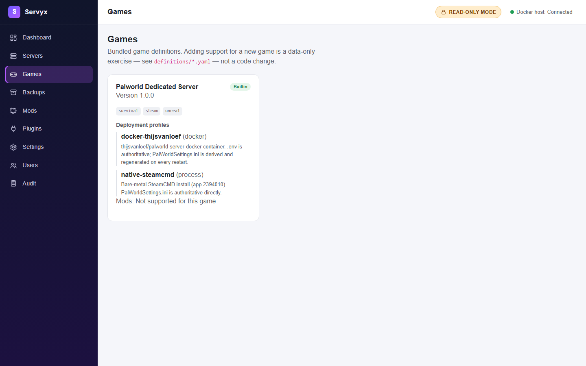

# Adopting servers

## Adoption, not ownership

Servyx **adopts** existing game server containers — it never creates one on your behalf and never assumes it owns something it didn't create. When you point Servyx at a Docker host, it looks for containers matching a bundled game definition and lists what it finds as candidates. Adoption is read-only recognition, not a takeover: Servyx does not touch a container's lifecycle, files, or configuration just by discovering it, and everything mutating stays disabled until a later milestone enables writes (see [Control tiers](control-tiers.md)).

This distinction matters because it bounds what Servyx will ever do to a container you didn't ask it to manage. A container it merely adopted is treated with the same caution as one it will never be able to fully control.

## Checking what's supported before you adopt

The `/games` page lists the game definitions bundled with this Servyx installation — today, that's a single entry for Palworld. Each definition shows its declared trust tier, tags, whether mod installation is supported (not yet, for Palworld — the definition declares `mods.supported: false`), and its **deployment profiles**: the distinct ways that game can be deployed and detected. The Palworld definition itself declares two — a Docker profile (`docker-thijsvanloef`, matching the `thijsvanloef/palworld-server-docker` image, where `.env` is authoritative and `PalWorldSettings.ini` is regenerated on every restart) and a bare-metal profile (`native-steamcmd`, where the INI is authoritative directly, with no regeneration step).

**What you'll actually see depends on how Servyx is running.** The demonstration data set (`Servyx:DataSource=Mock`) shows both profiles, to illustrate the distinction. Running against a real Docker daemon today, Servyx's startup loader reads only the bundled definition's metadata and its *first* deployment profile — so the live `/games` page currently shows just the one Docker profile, not the second, bare-metal one, even though the underlying YAML declares it. This is a known gap in the current milestone's definition loading, not a reflection of what the schema supports — see [the schema reference](../schema.md) for what a full definition can declare.

This page is a good first stop before trying to adopt anything: if your game and deployment shape isn't listed here, discovery has nothing to match it against.

## What discovery inspects

For Docker, a container is proposed as a match for a game definition (Palworld, by default) when **both** of the following hold:

- Its image repository matches the definition's expected repository (the tag or digest is ignored — `thijsvanloef/palworld-server-docker:latest` and `:v1.2` both match the same repository).
- It has a mount whose *container-side* destination matches the path the definition expects (for Palworld, the mount into `/palworld`).

Discovery reads container metadata only — image, state, health, ports, mounts, network, resource limits, environment variables, and Compose labels if present. It never writes to the container, and it never assumes a partial match is good enough: both conditions must hold before a container is proposed at all.

## Reading the server list

Each row on `/servers` (and the equivalent table on the dashboard) shows:

| Column | Meaning |
|---|---|
| Name | The server's display name. |
| Game | Which game definition it was matched against. |
| State | The server's *lifecycle* state — `Stopped`, `Starting`, `Running`, `Stopping`, `Crashed`, or `Unknown` — derived from Servyx's own readiness detectors, not from Docker. |
| Health | The container's *own* reported health, shown as a clearly separate signal from State. Docker health and game readiness can and do disagree — see [Troubleshooting](troubleshooting.md) for the classic case where a container reports unhealthy while players are online. |
| Players | Players online out of the server's configured maximum. |
| Uptime | How long the workload has been running. |
| Host | Which host the server is running on. |
| Ports | Each declared port, labelled with its purpose (game, query, RCON, REST, …), with published ports to the host visibly distinguished from ports that only exist inside the container network. |

Selecting a row opens the server's detail page, with Overview, Console, Settings, Saves, and Backups tabs.

The Overview tab shows power controls (Start/Restart/Stop/Kill — all locked in the current milestone), status, network details, and storage/resource limits, all read from the live container.

---
**Next:** [Control tiers](control-tiers.md) · **See also:** [Architecture](../architecture.md)
