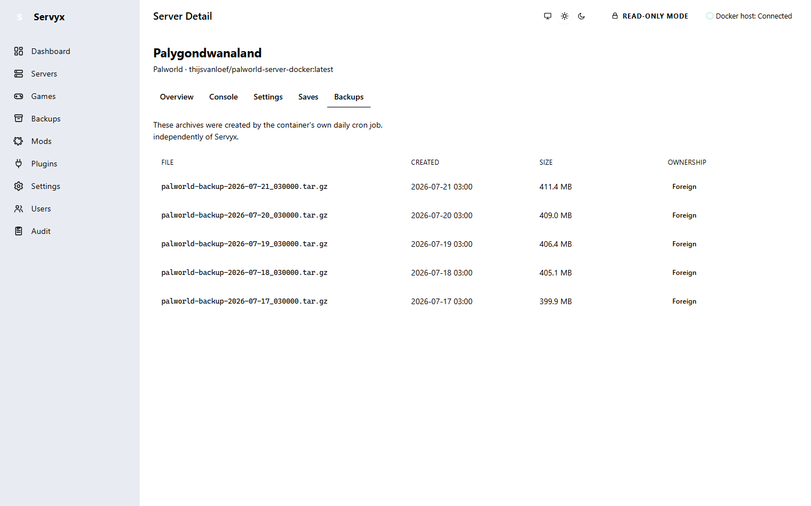
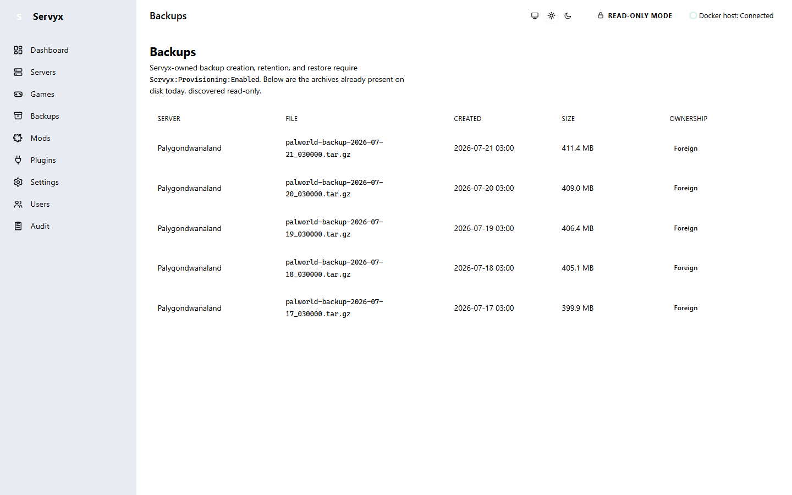
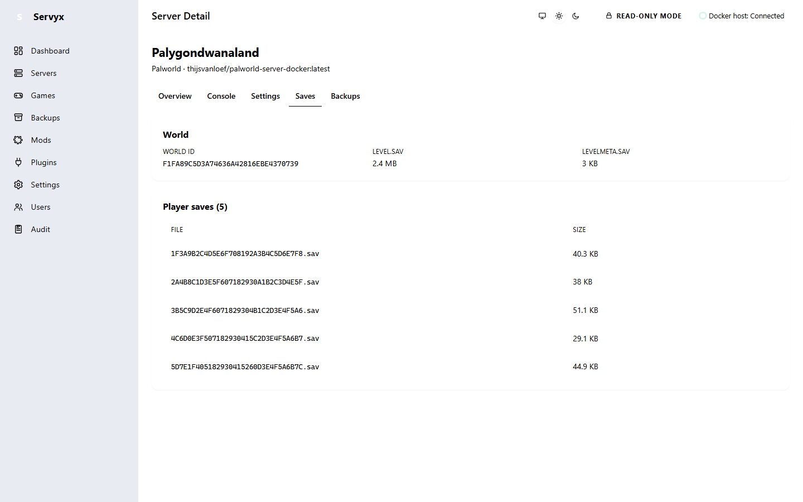

# Backups and saves

## Foreign vs Servyx-owned archives

An archive Servyx finds on disk that it did not create itself is **foreign**. For the standard Palworld Docker image, that typically means the `.tar.gz` files the container's own daily cron job produces — entirely independent of Servyx. Servyx lists these, shows their name, creation time, and size, and marks them clearly as **Foreign**.

Servyx can also create and own its own archives now — see [Creating, restoring, and retention](#creating-restoring-and-retention) below — but that capability is off by default and gated behind the same provisioning and per-server write grants as every other mutating action. With no grant, every backup you see was made by something other than Servyx, and the page below stays purely read-only.

## Why foreign archives never get delete or prune controls

Foreign archives never get a delete, prune, or retention control — not even a disabled one — regardless of write access. This isn't an oversight: Servyx does not own these archives, has no retention policy governing them, and must never appear to offer destructive control over a file it didn't create. (Restoring *from* a foreign archive is a different question — see below.)

## The per-server Backups tab

Each server's detail page has a Backups tab listing that server's own on-disk archives — file, created time, size, and ownership. With `Servyx:Provisioning:Enabled` off (the default), this is a read-only listing, scoped to one server. With it on, the tab instead links to the estate-wide `/backups` page below, rather than growing a second copy of the same create/restore flow.

## The estate-wide Backups page

With provisioning off, `/backups` shows the same kind of read-only listing across every adopted server at once — server, file, created time, size, ownership — so you can see backup coverage across your whole estate in one place, rather than clicking into each server individually.

With `Servyx:Provisioning:Enabled` on, `/backups` becomes the managed surface: pick a server, and — for one that also carries a `WriteMode.Enabled` write grant (see [Enabling writes](enabling-writes.md)) — create, inspect, restore, and prune its archives. A server without that grant still lists and inspects its archives here; creating, restoring, and pruning are simply not offered for it, because the write guard would refuse them anyway.

## Creating, restoring, and retention

These require both `Servyx:Provisioning:Enabled` and the selected server's write mode to be `Enabled`. Everything destructive is previewed first and confirmed separately:

- **Create** archives the server's save tree, quiescing it first where the deployment declares a flush step (a failed flush aborts the backup rather than archiving unflushed state). Confirming is a second, explicit step — nothing is written on the first click.
- **Restore** previews a plan (which paths it would overwrite) before anything happens, then requires a separate acknowledgement checkbox on top of the confirm button. Restore is offered for **both** Servyx-owned and foreign archives — inspecting or restoring from a foreign archive doesn't require owning it. Applying a restore overwrites live save data with no undo, and Servyx does not take a backup on your behalf first.
- **Retention (prune)** always previews as a dry run first, naming exactly which archives it would remove, before a separate "apply" click deletes anything. Retention only ever selects from the server's **Servyx-owned** archives — foreign artifacts are never candidates, in preview or in practice.

**Archives contain configuration files in cleartext.** A Servyx-created archive includes the server's `.env` and compose file alongside its save data, so a restore can bring back the exact configuration a world was running under. Those files contain the admin/RCON password and any other secrets set through the dashboard, unencrypted. Handle downloaded archives the same way you'd handle those credentials directly — don't share them, and store them somewhere access-controlled.

## The Saves tab

The Saves tab shows the server's world data directly from disk:

- **World ID** — the world's identifier.
- **Level file** — the main save file and its size (for Palworld, `Level.sav`), alongside its companion metadata file.
- **Player saves** — one entry per player who has joined the world, with file name and size. A world with no players yet shows an empty list rather than an error.

If the world directory can't be read at all, the tab says so plainly rather than showing a blank or misleading page.

---
**Next:** [Console and logs](console-and-logs.md) · **See also:** [Architecture — IBackupProvider / IBackupAdopter](../architecture.md)
