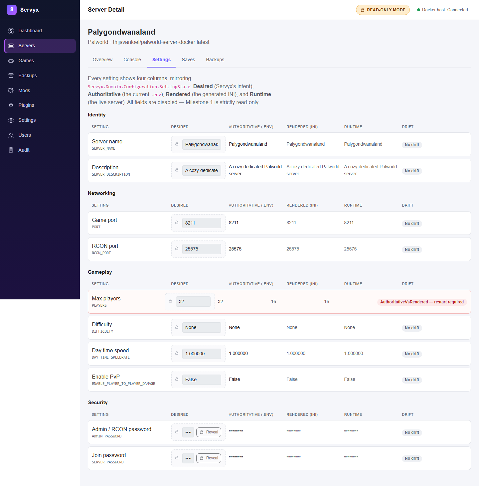

# Configuration

## What works today

Servyx **reads** configuration, **records** what you want it to be, and can now **write** it to the server when you approve a plan.

| You can | You cannot yet |
|---|---|
| See all four columns for a setting, computed by reading the real files on the real server. | Revert an applied change from the UI — there is no revert yet; the only way back is to record new desired values and apply a fresh plan. |
| See genuine drift — Servyx compares what it actually read, not what it assumes. | Have Servyx restart or recreate the server for you. Applying a change writes bytes to disk and nothing else; if the change needs a restart or a container recreate to take effect, you still do that yourself. |
| Record a desired value, so your intent is stored and shows up in the Desired column. | Reach this from anywhere except the settings tab — there is no REST endpoint, MCP tool, or scheduled job that previews or applies a change; the settings tab's confirmation flow is the only path. |
| Preview a plan built from your recorded desired values — a diff, its consequences, and anything that would be blocked — before anything is written. | Have a change applied automatically. Applying always requires you to review the diff and confirm a second time. |
| Approve and apply that plan, writing exactly the diffed bytes to the server. | Trust an interrupted apply to finish or clean itself up. A failed write mid-plan is left exactly as it landed, for you to inspect. |

Recording a desired value only ever writes to Servyx's own database — it is a note to yourself and to a future Servyx, and by itself changes nothing on the server. Below the settings grid, a **Review changes** control turns your recorded desired values into a plan: a unified diff per file, any consequences (for example, a restart or container recreate the change will require), and anything that can't be written explained as a blocked change. Previewing reads only what you've *saved* as a desired value, never unsaved text still sitting in an editor field — if you have unsaved edits, Servyx tells you which ones and asks you to save them first, rather than silently leaving them out of the plan.

If the plan can be applied, a two-step **Review → confirm** control appears under it. Confirming writes exactly the bytes shown in the diff to the server — nothing is re-derived, and nothing else happens: Servyx does not restart or recreate the workload as part of applying. If the plan named a restart or recreate consequence, that follow-up is still yours to do by hand (recreate in particular: Servyx cannot recreate a container yet). There is no revert — the only way back is to preview and apply a new plan. And if a write fails partway through a multi-file plan, Servyx does not retry or roll back what already landed; it reports exactly which changes made it and leaves the rest for you to resolve, since a second write chasing a bad first one risks damaging the file further.

Applying is only possible when the server's write access is `Enabled`; a read-only or preview-only server shows why the change can't be applied instead of an apply control. See [Enabling writes](enabling-writes.md).

## The four columns

Every setting Servyx tracks for a server is shown across four columns, side by side:

| Column | What it is |
|---|---|
| **Desired** | Servyx's own record of your intent — what you asked for. |
| **Authoritative** | The current value in the file Servyx is actually allowed to write to (typically `.env`). |
| **Rendered** | The current value in the file the game's own entrypoint generates from that authoritative source at boot — for Palworld, `PalWorldSettings.ini`. |
| **Runtime** | The live value on the running server, read over its control channel (RCON/REST) where available. |

These columns exist because a game server's "current setting" is not one fact — it's up to four facts that are usually in agreement and occasionally aren't. Each pair disagreeing means something different:

- **Desired vs Authoritative** — you asked for a change that hasn't been written to `.env` yet.
- **Authoritative vs Rendered** — `.env` has the new value, but the server hasn't regenerated its config file from it (usually: needs a restart).
- **Rendered vs Runtime** — the config file has the new value, but the running process hasn't picked it up yet.

Any of these disagreements is called **drift**, and Servyx flags it rather than picking one column and presenting it as "the" value.

### Which fact the Authoritative column is showing you

This one is worth being precise about, because the column shows one of **two different facts** depending on the setting, and they answer different questions.

For a setting that maps to an environment variable — which is most of them — Authoritative is **the live environment of the running container**, read from Docker's own inspect output. That is *what the workload is running with right now*.

For a setting that has no environment binding at all, Servyx falls back to reading the **authoritative file** on disk (`.env` on a standard compose deployment). That is *what the workload would start with next time*.

The distinction matters most in the case where the two disagree. If someone edits `.env` while the container is running, the file changes but the container's environment does not — a running container's environment is fixed at creation and cannot be edited in place. Servyx deliberately keeps showing you the **live** value rather than the file value, because preferring the file would make the change look already-in-effect when it is not. You would see "the new value" and reasonably conclude the server had picked it up.

So: a pending `.env` edit is real, is not yet in effect, and will require the container to be recreated before it is. Servyx shows the live value precisely so that gap stays visible instead of being papered over.

One wrinkle to be aware of: the column header in the settings tab is labelled **Authoritative (.env)**, which is where the value usually *comes from* but not where it was *read from*. For an environment-bound setting it was read from the container. If you have just edited `.env` and the column has not moved, that is the intended behaviour, not a stale reading.

## Telling Servyx where the files are

The four columns only work if Servyx can reach the files behind them, and on a Docker deployment those files live in **two different places**. The game's own config sits inside the container; `compose.yaml` and `.env` sit on the host, because the Docker API cannot see them at all. Servyx therefore opens a separate session for each, and you tell it where they are with two settings:

| Setting | What it does |
|---|---|
| `Servyx:Backups:ComposeDirectory` | The host directory holding the server's `compose.yaml` and `.env`. |
| `Servyx:Backups:ContainerDataRoot` | The data directory inside the container. Optional — Servyx falls back to the game definition's declared data directory, then to the container's own reported mount path. |

**If `ComposeDirectory` is unset, no host session is opened at all**, and every surface that lives there becomes unresolvable — which on every shipped definition includes `.env`, so the Authoritative column has nothing to read. Servyx will tell you the surface could not be resolved rather than quietly showing a blank.

There is deliberately no default and no guessing for this one. A compose directory cannot be discovered from inside a container, and a wrong guess would mean reading a real file from the wrong filesystem and presenting it as your server's configuration — so Servyx refuses to infer it.

## What to do about drift

Drift isn't automatically a problem — a value you just changed will legitimately drift for a moment until a restart catches it up. What matters is whether the drift is expected (you changed something and haven't restarted yet) or not (something changed outside Servyx — someone edited a file by hand, or the container was recreated from an older image). Servyx's job is to tell you which columns disagree and why; deciding what to do about it is yours. Servyx can now write the Authoritative side of that drift on your behalf — preview and apply a plan, as above — but it still never restarts or recreates the workload, so closing the Authoritative-vs-Rendered or Rendered-vs-Runtime gap, or investigating a change that happened outside Servyx, remains a step you take yourself.

## Byte-exact round-trip

A hard requirement underpins any future write: reading a file and writing it back out unchanged must reproduce it **byte-for-byte** — comments, blank lines, key order, and quoting style included. An editor that "normalises" a config file as a side effect of touching one value is not acceptable here, because that file is often hand-maintained and shared, and a diff full of incidental reformatting hides the one line that actually changed.

The file readers that satisfy this already exist and are what the columns above are read through — for `.env`, INI, `.properties`, JSON and YAML. They work by recording the exact character range a value occupies and replacing only those characters, rather than re-generating the file from a parsed model. One practical consequence you may notice once writing is enabled: a value that cannot be expressed as a change to a single line — a YAML block scalar, or a whole list such as a Compose `ports:` block — is readable but will not be writable. That is a deliberate limit of the byte-exactness approach, not an oversight.

See [the schema reference](../schema.md) for how individual settings map onto the files a game definition declares.

## Why editing the rendered file is the classic mistake

It's tempting to edit `PalWorldSettings.ini` directly, because that's the file the game visibly reads. Don't. For the standard Palworld Docker image, that file is **derived**: the container's own entrypoint regenerates it from `.env` on every boot, so a direct edit survives only until the next restart, then vanishes without a trace, and you're left wondering why your change "didn't stick" or silently reverted. The same file path can be authoritative on a different kind of deployment (a bare-metal install with nothing regenerating it) — the role belongs to the deployment, not the file format, which is exactly why Servyx tracks it as a first-class fact rather than assuming from the file's name or format. Change the `.env`/authoritative side; let the entrypoint regenerate the rest.

---
**Next:** [Secrets](secrets.md) · **See also:** [Game definition schema](../schema.md)
