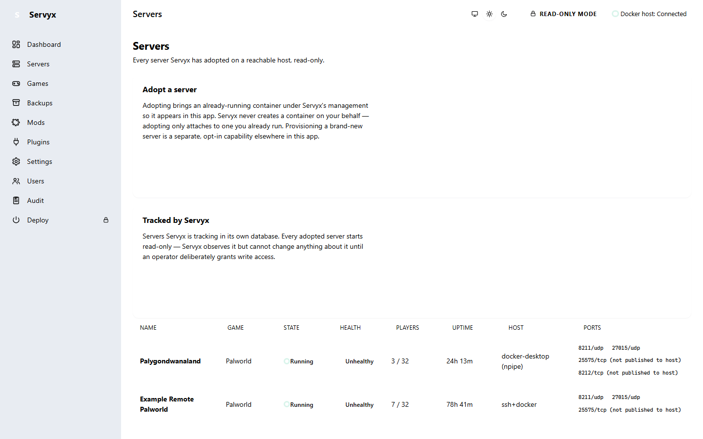

# Connecting a host

Servyx reaches a game server through a **transport** — the pipe it uses to talk to the machine the server runs on. Today that's Docker; SSH is implemented in the codebase but is not yet wired into the running dashboard (see "What works today" below).

## Local Docker

By default Servyx connects to the Docker engine on the machine it is running on: the standard Unix socket on Linux, or the Docker Desktop named pipe on Windows. This needs no configuration — if Docker is running and reachable, Servyx uses it.

## Remote Docker

Servyx's Docker transport also understands `tcp://` (and `http(s)://`) endpoints, and honours the standard `DOCKER_HOST` environment variable, so it can point at a Docker engine on another machine. There is currently no in-dashboard wizard for this — it is set once, at the process level, before Servyx starts, not per-server from within the UI.

## SSH and SFTP are independent channels

Servyx's design treats SSH exec (running commands) and SFTP (reading and writing files) as **two separate channels that happen to often travel over the same connection**, not one channel that assumes the other. This matters in practice: it is entirely normal for a host to allow you to run commands over SSH while its SFTP subsystem is disabled, or vice versa. When that happens, Servyx reports the exec channel as working and the file channel as degraded (or the reverse) — it does not collapse "I can't read your files" into "I can't reach your host," because those are different problems with different fixes. See [Connectors](../connectors.md) for the full model, including how Docker-over-SSH composes both channels together, since the Docker API itself cannot read `.env` or `compose.yaml` — those live on the host filesystem, not inside anything the Docker API exposes.

**What works today:** the SSH transport and its exec/SFTP composition are implemented and have their own test suite, but are not yet connected to the running `Servyx.Web` dashboard. Today's dashboard is Docker-only end to end. Treat this section as describing the model you'll configure once SSH hosts are exposed in the UI, not a feature you can use from the dashboard yet.

## Host-key trust (TOFU)

Servyx pins SSH host keys using **trust on first use**: the first time it connects to a host, you are shown that host's SHA-256 key fingerprint and asked to confirm it — ideally by checking it against a fingerprint you obtained out of band (from the host provider, or by running `ssh-keygen -lf` on the box itself). Once confirmed, the fingerprint is pinned and stored, by default, in `servyx-data/host-keys.json`.

There is deliberately **no "accept any host key" setting anywhere in Servyx** — not a checkbox, not a config flag. That omission is intentional: a system that can express "skip verification" eventually has that value set by someone under time pressure, and host-key checking stops meaning anything at all.

### When a host key changes

If a host presents a different key to the one pinned, Servyx treats this as a security event, not a routine connectivity problem:

- The connector is evicted immediately — no further operations run against it.
- A prominent warning is raised naming both the old and new fingerprints.
- Reconnecting requires an explicit, separate re-pin action.

**Do not blindly re-pin.** A changed host key usually means the host was rebuilt (a genuinely new key, expected after a reinstall) — but it can also mean something is intercepting your connection. Before re-pinning, confirm the new fingerprint against an independent source (the host provider's console, a fingerprint you saved when you first built the box) the same way you did on first connection.

## Connected vs degraded

A host connection isn't simply up or down. Servyx reports, per connector: what's reachable at all, which specific channels are working, and which are degraded — along with the reason. A host can be fully reachable while one file-access channel is unavailable; that's a degraded connector, not an unreachable one, and the two are fixed by different people (a network problem versus, say, a disabled `sftp` subsystem in `sshd_config`).

---
**Next:** [Adopting servers](adopting-servers.md) · **See also:** [Connectors](../connectors.md)
