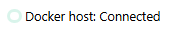

# Diagnostics

Servyx is built to fail honestly: when something can't be reached, it says exactly what it tried and why, rather than collapsing every kind of absence into a bare empty page. This guide is a map of every place Servyx surfaces that detail, so when something looks wrong you know where to look and what the message actually means.

## The connection status in the top bar



Every page shows a small status pill in the top bar: `Docker host: Connected` / `Degraded` / `Disconnected`, with a dot coloured to match. Hover or focus it and its tooltip explains the status.

That tooltip text is **real, transport-reported detail** — not a hardcoded claim about a specific transport. Earlier versions of this UI always said something like "reachable over the npipe transport", which was only ever true when Servyx was actually talking to Docker Desktop on Windows and was an active falsehood the moment it was pointed anywhere else. Today the tooltip prefers whatever detail the transport's own probe reported, and only falls back to a generic, transport-name-aware message when the probe didn't report one at all.

What the detail actually says depends on which transport answered the probe:

- **Local Docker** (the default transport) probes by calling the Docker API's own version endpoint. On success, the detail is the exact server version string, e.g. `Docker 27.3.1 (API 1.47) on linux/amd64, kernel 6.6.87.2-microsoft-standard-WSL2` — the screenshot above shows this. On failure, it's `Docker engine unreachable: <the underlying exception's message>`.
- **A remote host over `ssh+docker`** (see [Adopting a remote host](adopting-a-remote-host.md)) probes by connecting over SSH and running `docker version` there. The SSH connection itself failing is reported as unreachable directly; once connected, the exit code of that command is mapped to a specific, actionable explanation:

  | Exit code | Meaning |
  |---|---|
  | `0` | Healthy. The detail carries the remote Docker daemon's own version string, same as the local case. |
  | `127` | The `docker` executable is not on the SSH user's `PATH` on the remote host — `docker` CLI not found. |
  | `126` | `docker` was found but could not be invoked — almost always a permissions problem: the SSH user is not in the `docker` group and can't reach the Docker socket. |
  | any other non-zero | A truncated (~200 character) excerpt of the command's `stderr` is included, capped so a probe failure can never leak an unbounded amount of remote output — or a secret embedded in it — into connection status. |

## Discovery failure is not the same fact as "there are no servers"

`GetServersWithStatusAsync` returns a result shaped as servers, plus **whether discovery itself failed**, plus a failure detail when it did — not just a server list. This exists because a bare empty list is ambiguous in a way that matters: "Servyx asked Docker for containers and got zero back" and "Servyx couldn't ask Docker at all" look identical if you only render the list, and the second one is the dangerous case — it can look exactly like a healthy, server-less host when there might be adopted servers Servyx simply can't currently see.

When discovery fails, the servers list renders a distinct, clearly worded banner instead of a quiet empty state:

```html
<p data-testid="servers-discovery-failed">
  <strong>This may not be accurate.</strong> Servyx could not read the server list from the
  Docker host: <detail>. There may be adopted servers Servyx cannot currently see.
</p>
```

The demonstration data set always reports discovery as successful (with two servers), so this banner isn't something the bundled screenshots can show without inventing a failure that isn't real — but if you see the servers page rendering this text instead of "No servers adopted yet", read it as exactly what it says: the *list* is untrustworthy, not necessarily empty of it.

## Backups: three states, not two

The `/backups` page (in its read-only, non-provisioning view) distinguishes three genuinely different facts about the backup listing, via `BackupsAvailability`:

| State | `data-testid` | What it means |
|---|---|---|
| **Not configured** | `backups-not-configured` | No `IBackupProvider` is registered in this process at all — normal with `Servyx:Provisioning:Enabled` off (the default). Nothing has been looked at on disk. This is not the same claim as "there are no backups." |
| **Listing failed** | `backups-list-failed` | At least one server's backups could not be listed, and the failure detail is shown alongside the banner. Also not the same as "there are none" — the listing itself could not be produced. |
| **Listed, empty** | `backups-empty` | The listing *was* produced, and it genuinely found nothing. This is the only state that may honestly render as "No backups found." |

The demonstration data set always reports `Listed` with five archives (see [Backups and saves](backups-and-saves.md) for that screenshot) — provisioning is off by default in the demo, which is also the normal, expected condition for `backups-not-configured` in a real deployment that hasn't turned on provisioning. The other two states aren't things the mock can produce, so no screenshot below claims to show them; treat the table above as the authoritative description of what each one looks like.

## RCON reachability: no channel configured vs. unreachable

These are two different situations, and Servyx keeps them visibly distinct on a server's Console tab.

**No channel configured at all** happens when nothing in configuration turned RCON on for a server (`Servyx:Servers:<name>:Rcon:Enabled` unset, or the provisioning gate closed entirely). This is the state the demonstration host is actually in — no RCON wiring is configured for either seeded server — so it's a real, reproducible screenshot rather than a fabricated one:


**Unreachable** is a different case: a channel *is* configured, but every reachability strategy Servyx tried failed to reach it. The definition declares an ordered list of strategies — `direct-tcp`, then `docker-exec-tool`, then `docker-exec-network` — and Servyx tries each in turn, falling through to the next on failure. If none succeeds, it raises `RconUnreachableException` naming **every strategy tried and why**, rendered verbatim on the Console tab rather than a generic "RCON failed":

- `direct-tcp` reports the raw TCP-level failure — a socket error such as connection-refused (exactly what you'd expect when a port isn't published to the host, as is the case for RCON 25575 on the bundled Palworld image — see [Adopting a remote host](adopting-a-remote-host.md)), or that the connection attempt timed out.
- `docker-exec-tool` (only tried when a remote `ssh+docker` host is configured, since it needs somewhere to run `docker exec`) reports the probe's own exit code, e.g. `probe 'which rcon-cli' exited 127` when the image doesn't bundle the `rcon-cli` tool it's looking for.
- `docker-exec-network` is declared by the definition but not yet implemented in this milestone, and always reports itself unavailable with a fixed explanation rather than silently vanishing from the list of things tried.

The demonstration host has no RCON channel configured for either seeded server, so this exception path isn't something the bundled screenshots can show without simulating a failure that didn't really happen — the "no channel configured" state above is the honest, capturable neighbour of this one.

## Where to look when nothing appears

1. **Check the connection status pill first.** If it says `Disconnected`, nothing downstream of it (server list, health, backups) can be trusted regardless of what it shows — fix reachability before anything else.
2. **If the servers list shows an empty state, read which one.** "No servers adopted yet" with no banner means discovery succeeded and genuinely found nothing to adopt — see [Adopting servers](adopting-servers.md) for what discovery requires. The `servers-discovery-failed` banner above it means the opposite: don't trust the emptiness.
3. **On `/backups`, the heading text tells you which of the three states you're in** — "No backup provider is configured", "Backups could not be listed", or "No backups found" are three different problems with three different fixes.
4. **On a server's Console tab**, "No RCON control channel is configured for this server" means configuration, not connectivity — nothing has been asked to try yet. Any other error there names every strategy Servyx actually attempted.
5. **For a `ssh+docker` host specifically**, see [Adopting a remote host](adopting-a-remote-host.md) for host-key pinning and secret-import failures, which fail at startup rather than surfacing here.

---
**Next:** [Troubleshooting](troubleshooting.md) · **See also:** [Adopting a remote host](adopting-a-remote-host.md) · [Connecting a host](connecting-a-host.md) · [Backups and saves](backups-and-saves.md)
