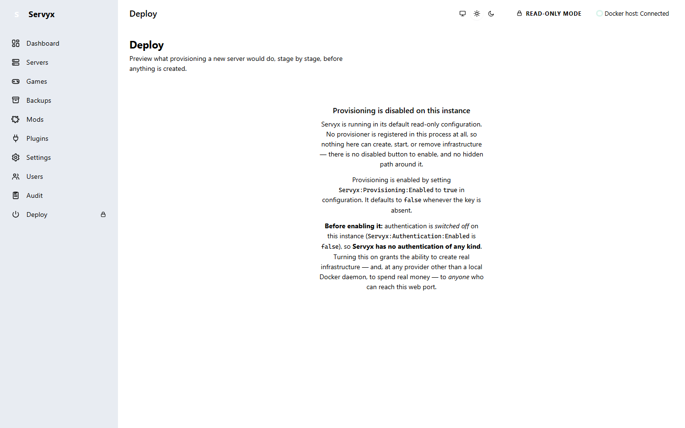

# Enabling writes

Servyx started as a read-only tool and has since gained the ability to change a server's state — but that ability ships **off**, and turning it on is a deliberate, per-server act. This page explains what "on" actually means, how to grant it, and what Servyx tells you at startup once you have.

## Read-only by construction, not by policy

Every command Servyx could send anywhere declares whether it only observes or whether it might change something. That declaration has a default, and the default is the safe one: an undeclared command is treated as **mutating**. A caller that forgot to think about intent gets refused, never silently permitted.

This is enforced at a single seam — the write guard — that every transport passes through before it touches a socket, a file, or the Docker API. The refusal happens **synchronously, before any I/O**: a mutating call on a server that isn't write-enabled never opens a connection, never sends a byte, and never gets a chance to fail halfway through. It just doesn't start.

Container lifecycle (Start/Restart/Stop/Kill) goes through the same guard by a different door: there is deliberately no "read-only" member on the lifecycle-verb enum, because none of those four operations is ever anything but mutating. There is no argument you can pass to opt one out of the check.

## Two independent switches

Turning writes on for a server requires **both** of these, and Servyx will not act on just one:

1. **`Servyx:Provisioning:Enabled`** — a process-wide flag, defaulting to `false`. With it off, nothing below it is even read: no per-server write grants exist in the running process at all, regardless of what else the configuration says.
2. **A per-server write mode** — set from the server's own page in the UI, individually for each server you want to grant, and recorded in Servyx's database against that server's row. A server you have not granted anything stays read-only, and so does a container Servyx does not track at all.

There is deliberately **no single global "enable writes" switch**. Both gates exist so that turning on the capability process-wide (step 1) and deciding which specific server may actually use it (step 2) are two separate, deliberate decisions — an operator can't end up writable "by accident" from one flag flip.

## Grants are doubly narrow

A write grant is never open-ended. It is matched against a specific target by **both** its transport endpoint and its container name — constructing a grant for `WriteMode.Enabled` or `WriteMode.PreviewOnly` without naming a specific endpoint, a specific container, or both is rejected outright; only a `ReadOnly` grant (which changes nothing) is allowed to be unconstrained.

Practical consequences of that narrowness:

- **Recreating a container returns it to read-only.** The grant is bound to the container's durable identity — the id its own daemon assigned it — not to its name. Destroying a container and creating a new one produces a workload you never granted anything to, even if it answers to the same name, and Servyx refuses it until you grant it again.
- **Renaming a container keeps the grant**, because a rename does not change the identity the grant was written against. That is deliberate: a cosmetic rename is the same workload, and revoking on one would be a surprise with no safety payoff.
- **Re-pointing a host** is *not* currently checked. Servyx does not yet model which host a server runs on — the column exists but nothing populates it — so a grant is not bound to a host today, and this page does not claim it is. In practice a container id is a 64-hex value assigned by one daemon and is not portable between hosts, so re-pointing a host will usually fail the identity check anyway; that is a consequence of how container ids work, not a check Servyx performs, and it would not hold for a container migrated with its id preserved.
- **"Enable writes for everything this daemon can see" is not an expressible configuration.** There is no shape of grant that means that.

## The three write-mode tiers

| Tier | What it permits |
|---|---|
| **ReadOnly** | Only commands declared read-only (e.g. RCON's `info`, `players`) ever reach the target. Every mutating call is refused before it starts. This is the default for every server. |
| **PreviewOnly** | At the write guard itself, this behaves identically to `ReadOnly` — it refuses exactly what `ReadOnly` refuses. The difference lives one layer up, in what a page is willing to compute and show you: under `PreviewOnly` a page may render what a mutating action *would* do (for example, the ordered stop-escalation ladder — see [Lifecycle control](lifecycle-control.md)) without offering any way to apply it. |
| **Enabled** | Mutating commands reach the target, subject to the write guard's own per-call checks. |

`PreviewOnly` is a reasonable staging step before granting `Enabled` on a production host: it lets you see exactly what Servyx would do to a server without any risk of it actually happening, since nothing under `PreviewOnly` can write regardless of what a page renders.

Both tiers change what the server detail page's Power card renders: `PreviewOnly` shows the ordered stop-escalation ladder and no controls at all, `Enabled` shows the same four controls live and clickable. See [Lifecycle control](lifecycle-control.md) for both states illustrated and for exactly what each of Start, Restart, Stop, and Kill does.

## What a locked control looks like

Every mutating control — every power button, every settings field, the console command box — renders even when it can't be used: greyed out, with a lock icon, and a tooltip explaining why. Nothing is hidden just because it isn't currently usable.


See [Control tiers](control-tiers.md) for the fuller picture of why Servyx always shows a locked action rather than removing it.

## Startup warnings

Servyx logs its write posture out loud at startup, not just in the UI:

- **Any server granted a write mode above `ReadOnly` is logged at Warning**, naming every such server and the mode it was granted — a process running with quiet write access to a server is never silent about it in its own logs. Every later change to a grant is logged the same way, at the moment it is made, with the operator identity it was attributed to.
- **If authentication is off (`Servyx:Authentication:Enabled = false`) and at least one server is granted `WriteMode.Enabled`, that combination is logged at Critical.** With no login and no session, write access belongs to anyone who can reach the web port, not just to you — and Servyx says so as loudly as it says the equivalent combination for provisioning itself (creating infrastructure with no authentication).



The screenshot above is from the Deploy page, which surfaces the same provisioning-gate story documented here: its `Servyx:Provisioning:Enabled` config key, and — because this demonstration instance runs with authentication switched off — the same "anyone who can reach this web port" warning `Servyx` logs at Critical when writes and no authentication are both true.

## Example configuration

Only the process-wide master switch lives in configuration. It is host-owned on purpose: nothing in the UI can change it, so a web-tier compromise cannot turn a read-only host into a writable one.

```json
{
  "Servyx": {
    "Provisioning": { "Enabled": true }
  }
}
```

Restart Servyx after changing it. Then grant individual servers from their own pages: open a server, go to **Overview**, and use the **Write access** card. Granting is a two-step confirmation, and the change is recorded on the server's row with who made it and when.

A grant takes effect on the **next command** — including on connections that are already open — and so does a revocation. You do not need to restart Servyx to grant or revoke.

### If you have an old `Servyx:Servers:<name>:WriteMode` key

That key **no longer grants anything** to a server Servyx tracks. It is not imported and it is not honoured as an override, and Servyx logs a warning at startup naming every such key it found. Re-grant those servers from the UI.

The key was not migrated for you on purpose. It names a container by *name*, while a grant is bound to a container *id*, so importing it could attach write access to a different workload than you had in mind — and a configuration file can be stale, copied from another host, or committed to a repository. Failing closed and asking you to click once is the safer trade.

(The same key is still read for containers you declared explicitly under `Servyx:Hosts` — reached over `ssh+docker` — and for SSH backup endpoints. Servyx does not yet adopt those into its database, so there is nothing there for a database grant to replace.)

### A note on multiple Servyx processes

If you also run the stdio MCP host, it keeps its own copy of the grants and does not see changes made in the web UI until it restarts. The dangerous direction is revocation: an agent driving a server over MCP would keep writing to a server you believe you just locked. **Restart the MCP host after changing a grant.**

---
**Next:** [Lifecycle control](lifecycle-control.md) · **See also:** [Control tiers](control-tiers.md)
