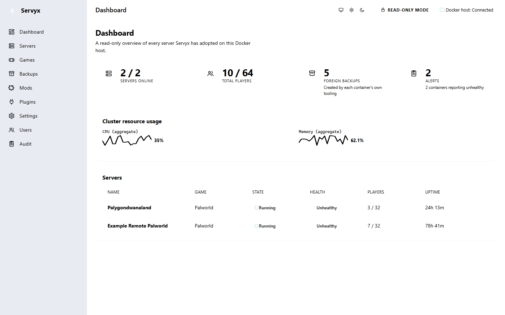

# Servyx user guide

Servyx is a self-hosted control panel for game servers. It runs alongside servers you already have — on local Docker, a remote Docker host, or a bare-metal box reachable over SSH — and gives you one dashboard to see their state, health, configuration, and backups.

This guide is for **operators**: the person running Servyx to look after one or more game servers. If you want to read or change Servyx's own source code, see the [developer documentation](#developer-documentation) instead.

## Servyx is pre-alpha

Servyx is under active development. It started strictly read-only, and has since gained real write capability — starting, stopping, and restarting a server, sending RCON commands, and creating and restoring backups — but every one of those stays **off** by default: an operator must explicitly grant write access per server before any of it can act (see [Enabling writes](enabling-writes.md)). A server with no grant behaves exactly as every server did before writes existed: every mutating control is visibly present and visibly disabled, with a reason. See the [roadmap](../roadmap.md) for what's still planned and when.

Several pages in the sidebar — Mods, Plugins, Settings, Users, Audit — are still placeholders today, for reasons unrelated to write access (mod support, identity/RBAC, and a dedicated audit UI each arrive in their own later milestone). This guide says so plainly wherever that is the case, rather than describing behaviour that does not exist yet.

## The read-only-first philosophy

Servyx's core design choice is to show you the truth about a server before it ever asks to change it:

- **It adopts, it doesn't own.** Servyx attaches to containers and hosts you already run. It never assumes it created something, and it never takes destructive control over something it didn't.
- **It starts blind and earns trust.** A server's control tier only rises when Servyx has evidence it may act — not because you toggled a setting.
- **A disabled button still tells you why.** Rather than hiding an action Servyx can't perform, it shows the action and explains, in plain language, what's missing.
- **Configuration is compared, never guessed.** Servyx reads your intent, your `.env`, your rendered config file, and the live server side by side, and tells you when they disagree.

## Map of this guide

Guides are grouped by what they're for: **operator guides** walk through doing something (connecting a host, turning on writes, restoring a backup); **reference** pages explain a model or serve as a lookup when something isn't behaving the way you expect.

### Operator guides

| Page | What it covers |
|---|---|
| [Installation](installation.md) | Prerequisites, running Servyx, the mock demonstration mode, where data lives. |
| [Connecting a host](connecting-a-host.md) | Local vs remote Docker, SSH/SFTP as independent channels, host-key trust, connecting a host from the `/hosts` page. |
| [Adopting a remote host](adopting-a-remote-host.md) | Connecting an `ssh+docker` host via `/hosts` or configuration, host-key pinning, getting its SSH key into the secret store. |
| [Adopting servers](adopting-servers.md) | What "adoption" means, what discovery inspects, reading the server list. |
| [Enabling writes](enabling-writes.md) | The two switches that turn write access on, the three write-mode tiers, and what each unlocks. |
| [Lifecycle control](lifecycle-control.md) | Start/Restart/Stop/Kill, the stop-escalation ladder, and two-step confirmation. |
| [The RCON console](rcon-console.md) | The catalogued command panel, read-only vs mutating commands, and how Servyx reaches RCON at all. |
| [Console and logs](console-and-logs.md) | Reading streamed console output and correlating it with a health badge. |
| [Backups and saves](backups-and-saves.md) | Foreign vs Servyx-owned archives, and creating, restoring, and applying retention once writes are on. |
| [Configuration](configuration.md) | The four-column model, drift, and why the derived file is the wrong place to edit. |
| [Deploying a server](deploying-a-server.md) | The Deploy page — creating infrastructure from nothing, rather than adopting something that already exists. |

### Reference

| Page | What it covers |
|---|---|
| [Supported games](../games.md) | Every game definition shipped today, its image, ports, control protocol, and what's still unverified. |
| [Control tiers](control-tiers.md) | The Blind → Observe → Configure → Operate → Provision ladder, in plain terms. |
| [Secrets](secrets.md) | What's masked, where secrets live, and what that means for backups. |
| [Diagnostics](diagnostics.md) | A map of every place Servyx explains a failure — connection status, discovery, backups, RCON reachability. |
| [Operator administration](operator-administration.md) | What "administration" means today — the operator password and the audit log — and which of Users/Audit/Settings are still placeholders. |
| [Troubleshooting](troubleshooting.md) | Common "why is this happening" questions, answered directly. |
| [Themes](themes.md) | The System/Light/Dark toggle, where the choice is stored, and every screen shown in dark theme. |

## Developer documentation

If you want to understand or extend how Servyx works internally, start with [`docs/architecture.md`](../architecture.md), which links onward to the abstractions, control-plane, connectors, schema, roadmap, and testing documents.

---
**Next:** [Installation](installation.md) · **See also:** [Architecture](../architecture.md)
