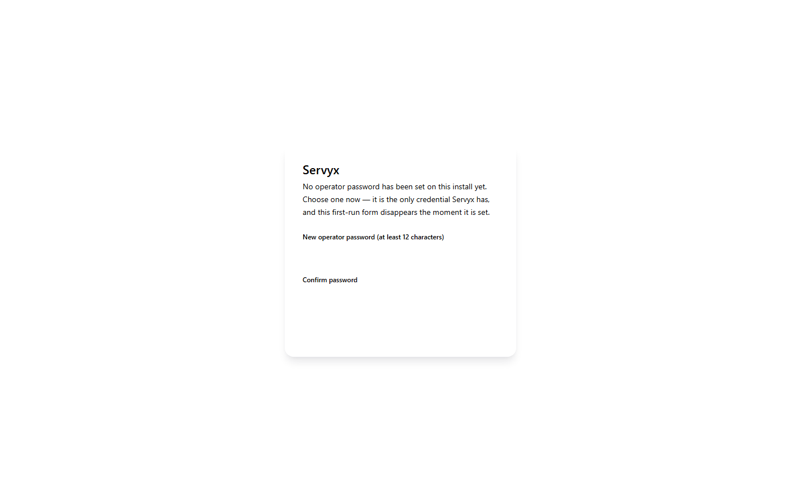

# Installation

## Prerequisites

- [.NET 10 SDK](https://dotnet.microsoft.com/download)
- [Docker](https://www.docker.com/), running and reachable, if you want Servyx to see real servers

## Getting the code

Servyx is not yet packaged for distribution — you build and run it from source:

```bash
git clone <repository-url> Servyx
cd Servyx
dotnet restore
```

## Running Servyx

The normal way to run Servyx during development is via the Aspire app host, which starts the Blazor dashboard (`Servyx.Web`) and wires up its dependencies for you:

```bash
dotnet run --project src/Hosting/Servyx.AppHost
```

Aspire is a **development-time tool only** — it never appears in a production deployment. The dashboard itself is an ordinary ASP.NET Core Blazor Server app, so you can also run it standalone, without Aspire, directly:

```bash
dotnet run --project src/Presentation/Servyx.Web
```

## Demonstration mode: `Servyx:DataSource=Mock`

By default Servyx talks to a real Docker daemon (`Servyx:DataSource` defaults to `Live`). If you want to look around the dashboard without a Docker daemon at all — no containers, no real data — set the `Servyx:DataSource` configuration value to `Mock`. The reliable way to do this is an environment variable:

```bash
Servyx__DataSource=Mock dotnet run --project src/Presentation/Servyx.Web
```

Note the **double underscore** — that's the .NET configuration binder's convention for a nested key (`Servyx:DataSource`) when it comes from an environment variable rather than the command line or a JSON file.

If you'd rather pass it on the command line, put a bare `--` before the app's own arguments so `dotnet run` forwards it instead of trying to parse it itself:

```bash
dotnet run --project src/Presentation/Servyx.Web -- --Servyx:DataSource=Mock
```

Without that `--` separator, some `dotnet run` invocations swallow the argument instead of passing it through — always include it for command-line configuration overrides. Either form is equally valid to set via `appsettings.Development.json` as well. In Mock mode the dashboard is served entirely from an in-memory data set, so every page — servers, settings, saves, backups, console — renders with representative sample data. This is the same data source the component test suite (`Servyx.Web.Tests`) binds to directly, and what the Playwright end-to-end tests run against.

## What you see on first load

Before any dashboard, servers list, or backups page, there is a sign-in gate. `Servyx:Authentication:Enabled` defaults to **true** — a misconfigured or unreadable flag must never widen what an anonymous caller can do — so on a fresh install, with no operator password ever set, the very first thing Servyx shows you is a one-time "set the operator password" form, not the dashboard:



Once you set that password you're signed in for that session, and every later visit shows the ordinary sign-in form instead of this one-time bootstrap. There is no separate user table, no roles, and no recovery flow beyond that one password — see [Secrets](secrets.md) for where it (and the rest of Servyx's own state) is stored. If you explicitly set `Servyx:Authentication:Enabled` to `false` (for local development only — never for anything reachable by anyone else), this gate is skipped entirely and every page is open.

With a real Docker daemon and no adopted servers yet, the dashboard, servers list, and backups page each show an empty state explaining that adopting an existing container is the first step. Servyx does not create anything on your behalf on first run — it looks for containers matching any of the bundled game definitions (Palworld, Minecraft, ARK: Survival Ascended, and Factorio ship today — see [Supported games](../games.md)) and lists what it finds. See [Adopting servers](adopting-servers.md) for what that matching looks for.

## Where data is stored

Servyx's own state — as opposed to the game server's own files — is written under a `servyx-data` directory next to the running application, by default:

| What | Default location |
|---|---|
| Encrypted secrets | `servyx-data/secrets/` (one file per secret) |
| Data Protection key ring | `servyx-data/secrets/.keys/` |
| Pinned SSH host keys | `servyx-data/host-keys.json` |

These paths are configuration defaults, not fixed constants — a real deployment can point them elsewhere. Back up this directory if you want to preserve Servyx's own state (secrets, host-key trust) across a reinstall; see [Secrets](secrets.md) for what backing up the key ring implies.

---
**Next:** [Connecting a host](connecting-a-host.md) · **See also:** [Testing](../testing.md)
