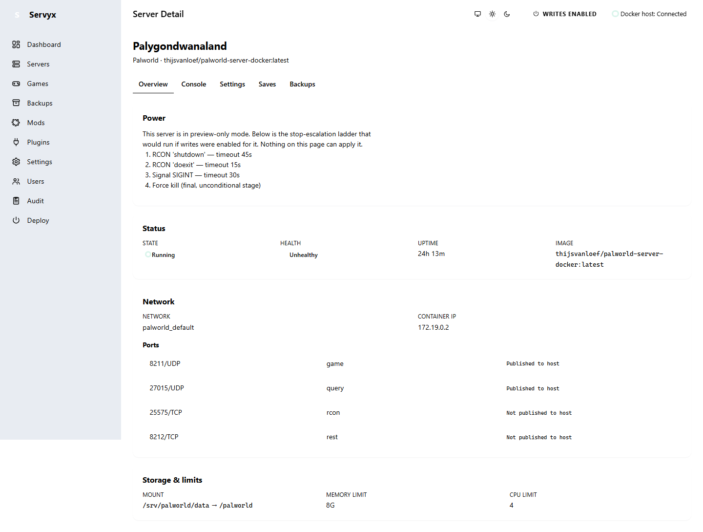

# Lifecycle control

Once a server is granted `WriteMode.Enabled` (see [Enabling writes](enabling-writes.md)), its detail page's Power card offers four actions: Start, Restart, Stop, and Kill. This page explains what each one actually does, the order Stop escalates through, and what Servyx honestly can — and can't — tell you while one is running.

## Start, Restart, Stop, and Kill

- **Start** starts a stopped container, then waits for the server to report itself ready (see Readiness probes below).
- **Restart** is a single Docker-level operation — Servyx asks the runtime to stop-then-start the container as one primitive, the same way `docker restart` does. It does **not** walk the Stop escalation ladder described below; that ladder only runs for an explicit Stop.
- **Stop** walks the ordered, definition-declared escalation ladder described below, stage by stage, until the container exits.
- **Kill** bypasses the ladder entirely — it goes straight to a forced, unconditional termination, the same final stage Stop only reaches after every gentler stage has failed to work.

## The stop ladder

Stop is not one action — it's an ordered sequence of increasingly forceful attempts, each one given a limited window to work before Servyx tries the next. For the bundled Palworld definition, that sequence is:

1. **RCON `shutdown`** (args: `seconds: 30`, `message: "Server shutting down"`) — warns connected players and gives the game 30 seconds to exit on its own. Servyx waits up to **45 seconds** for the container to exit before moving on.
2. **RCON `doexit`** — a more forceful in-game exit command, no player warning. Servyx waits up to **15 seconds**.
3. **OS signal `SIGINT`** sent directly to the container — a step below the game's own control channel entirely. Servyx waits up to **30 seconds**.
4. **Kill** — an unconditional `SIGKILL`. This is the final stage; it always succeeds at terminating the process.

Each stage escalates only after its own window elapses without the container exiting — an ordinary failure (RCON unreachable, a timed-out response) is logged and simply left to run out its stage's clock, which triggers the next stage exactly as if nothing had responded at all. The ladder escalates from "ask nicely, with warning" down to "no warning, no chance to save" specifically so that a graceful shutdown is always tried first, and force is only used once gentler options have had their chance.

## Critical safety property: a refusal aborts, it never escalates

If any stage is refused by the write guard — a `WritesDisabledException`, thrown because the server's write mode changed out from under an in-flight action, for instance — the **entire ladder stops immediately**. Servyx does not fall through to try the next, more forceful stage.

This matters because the alternative would defeat the guard's entire purpose: "you may not stop this politely" must never silently become "so kill it instead." A refusal is a refusal, not an invitation to escalate past it.

## Readiness probes after Start

After Start (or the start half of a Restart), Servyx doesn't declare the server ready just because the container is running — it waits for one of two independent signals, run **concurrently**, whichever answers first:

- **Log-regex** — watches the console output for the line the game itself prints when it's actually accepting connections. Waits up to **10 minutes**.
- **RCON `info` control-probe** — a fallback for when an upstream game update changes the log line the first probe watches for. Waits up to **12 minutes**.

The `info` control probe works even on a server whose write mode is `ReadOnly` — it's declared `readOnly: true` in the server's command catalogue, and read-only commands are permitted in every write mode. That's what lets Servyx report accurate live readiness for a server it isn't allowed to write to at all.

## Two-step confirmation

Restart, Stop, and Kill each require a second, explicit step before anything happens: clicking the action reveals a separate confirmation control naming exactly what confirming will do, with its own **Confirm** and **Cancel** buttons. This is a distinct on-page control, not a browser `confirm()` dialog — nothing is applied by the first click alone.

## Honest limitation: no live per-stage progress

Servyx does not show you which stage of the stop ladder is currently running. The lifecycle service reports which stage actually stopped the container only after the fact — there is no live "stage 2 of 4" feed. In practice this means: while a Stop is in progress, the page shows a busy state and nothing more specific, for as long as the ladder takes to resolve — worst case, on the order of **90 seconds** if every stage but the last times out. This is a deliberate honesty choice: Servyx has no way to know which stage is running right now without inventing a signal the underlying service doesn't provide, so it does not pretend to.

## What a locked Power card looks like

On a server without `WriteMode.Enabled`, every one of these four controls still renders — disabled, with a lock icon and a tooltip explaining that the server is in read-only mode and an operator must grant it write access first.

## What PreviewOnly renders instead

A server granted `WriteMode.PreviewOnly` (see [Enabling writes](enabling-writes.md)) doesn't show the four Power buttons at all — not even disabled ones. Instead, the Power card renders the ordered stop-escalation ladder itself: every stage, in order, with its timeout, so you can see exactly what Stop *would* do without any possibility of it happening. Showing even a disabled button here would look like a control that only needs one more click; `PreviewOnly` deliberately shows none.

---
**Next:** [Enabling writes](enabling-writes.md) · **See also:** [Control tiers](control-tiers.md)
