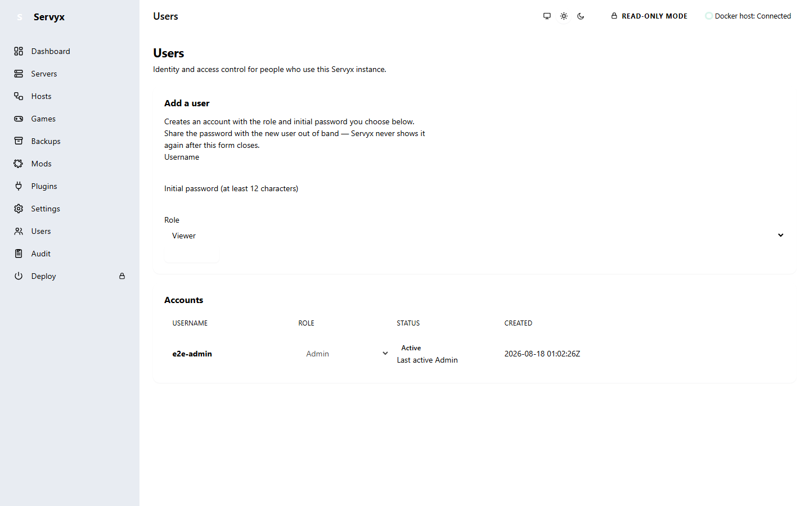
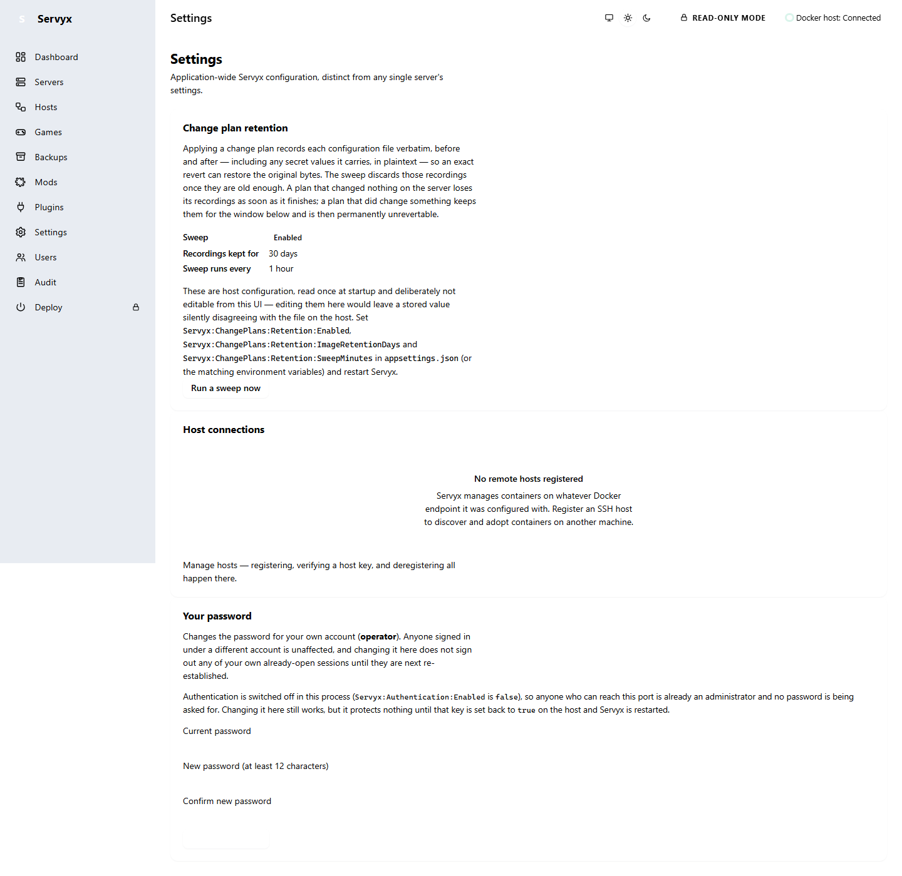
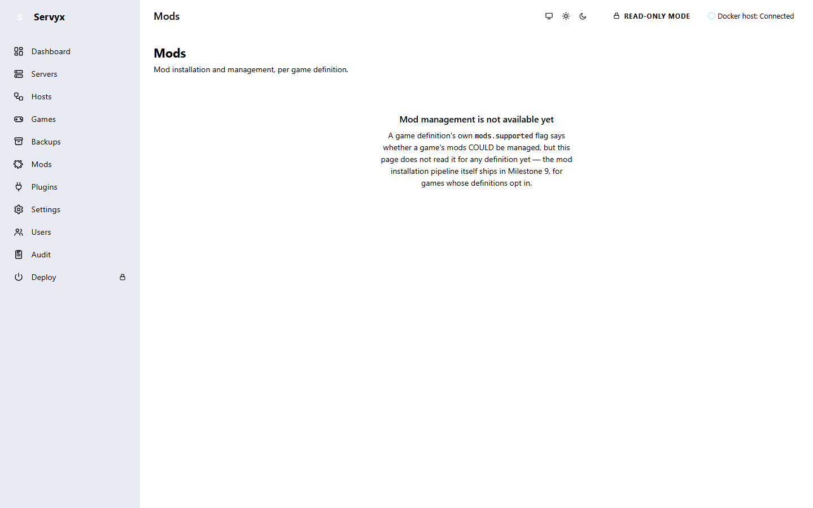
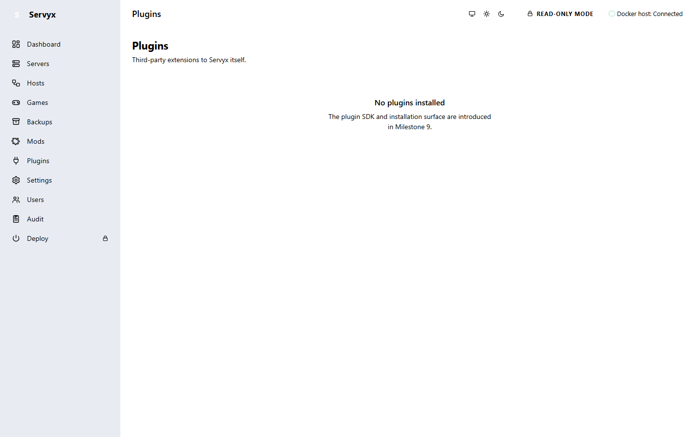
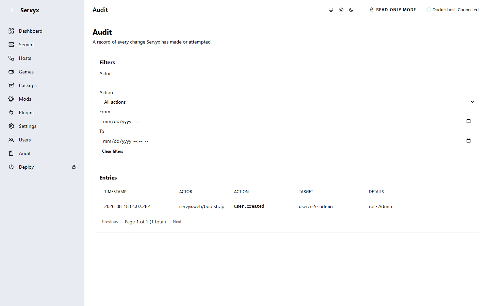

# Operator administration

"Administration" in Servyx today means one thing: the single operator password that gates every page. There
is no roles system beyond the one `Admin`/`Viewer` split, and — despite several separate items in the
sidebar — no dedicated management UI yet for most of it. This page documents what is real (the authentication
gate, the Audit page's accountability trail, and the audit *log* underneath it, all of which are enforced and
exercised on every request right now) and is honest about what is not (the Users and Settings *pages*, and the
Mods and Plugins placeholders, some of which still show only static, unstyled text).

## Users, Settings, Mods, and Plugins are placeholders today

All four sidebar pages this section covers — `/users`, `/settings`, `/mods`, `/plugins` — render the
same pattern: a heading and a short paragraph naming the milestone the real feature ships in, and nothing
interactive. They are combined into this one guide rather than four separate pages for exactly that reason:
individually, each is a handful of lines of static markup with no code-behind, no data, and no behavior to
document beyond the sentence it already shows on screen.

- **Users** (`/users`) — *"Identity, RBAC, secrets, and the audit UI arrive in Milestone 7."*
- **Settings** (`/settings`) — application-wide configuration, distinct from any single server's settings;
  same Milestone 7 placeholder text, plus a note that host connections and persistence become configurable
  from here once it lands.
- **Mods** (`/mods`) — *"Mods are not supported for Palworld"*, because the bundled game definition declares
  `mods.supported: false`; the mod installation pipeline itself ships in Milestone 9, for games whose
  definitions opt in.
- **Plugins** (`/plugins`) — *"No plugins installed."* The plugin SDK and installation surface are introduced
  in Milestone 9.

All four of these placeholders, like every other page in Servyx, render in either light or dark theme — see
[Themes](themes.md) for the toggle that controls it, and dark-theme captures of each placeholder above.

## The Audit page lists the accountability trail

Unlike the four pages above, `/audit` is no longer a placeholder. It carries the same
`RoleAuthorization.Admin` policy as `/users` — unconditionally, not only when `Servyx:Authentication:Enabled`
is on — so reaching it needs a real, signed-in Admin account. Once open, it lists the accountability trail:
the same authentication events documented in the table further down this page, newest first, each row naming
the event, the account or remote address involved, and when it happened.

Like every other page in Servyx, it also renders in dark theme — see [Themes](themes.md) for the toggle that
controls it, and a dark-theme capture of this page.

## Authentication is real, and it is fail-closed by default

Every page except the sign-in form itself requires the one operator password, enforced by `AuthenticationGate`
and the ASP.NET Core `FallbackPolicy` it drives. The configuration key is `Servyx:Authentication:Enabled`,
and unlike `Servyx:Provisioning:Enabled` (which defaults *closed*), this one defaults **open** — an absent
key, an empty string, or a typo like `"no"` or `"0"` all leave authentication **on**, because the cost of a
misread flag here is an unauthenticated administrator on whatever network path can reach the web port. Only
an explicit, parseable `false` turns it off, and that is documented as a local-development-only setting —
never for an instance anyone else can reach. See [Installation](installation.md) for the first-run "set the
operator password" screen this produces on a fresh install, and [Enabling writes](enabling-writes.md) and
[Deploying a server](deploying-a-server.md) for what this gate's state changes about the warnings those
pages show.

There is no separate user table and no roles: **one password**, stored as one PBKDF2-HMAC-SHA256 verifier
(`OperatorPasswordHash`). New verifiers are created with **600,000 iterations** — OWASP's current Password
Storage Cheat Sheet recommendation for PBKDF2-HMAC-SHA256 specifically (their 210,000 figure is the
recommendation for PBKDF2-HMAC-SHA512, not SHA-256). The encoded verifier is
`PBKDF2-SHA256$<iterations>$<salt>$<key>` — the iteration count and a per-install random salt travel with
it rather than being compiled into the app, so raising `Iterations` in a future build does not invalidate a
password already set; it is only re-derived at the new count the next time the password is changed.
Verification re-derives from the candidate at the stored parameters and compares in fixed time, so a
mistyped password cannot be distinguished, by how long the check took, from one that was merely close.
There is no recovery flow beyond that one password and no second credential — see
[Secrets](secrets.md) for where Servyx's own state, including this verifier, is stored on disk.

Sign-in has since moved to a `Users` table (one PBKDF2-HMAC-SHA256 verifier per account, same algorithm and
parameters as above), but the same "no recovery flow" rule holds for a *lost* password: there is still no
self-service reset for an account that cannot produce its current password, and nothing writes the
`PasswordHash` column except through the app itself. The one supported, explicit way to set or reset an
account's password out of band — e.g. bootstrapping a throwaway copy of the database for local verification,
without ever touching the real password — is the break-glass CLI verb
`dotnet run --project src/Presentation/Servyx.Web -- reset-admin-password <username> [--password <new-password>]`
(reads the password from `--password`, redirected stdin, or a masked prompt; never logs it). It only runs when
that verb is literally the first command-line argument, resolves the same `Servyx:Persistence:ConnectionString`
the running app would, and creates the account as `Admin` if it does not exist yet or resets its password if it
does. See `Servyx.Web.Authentication.AdminPasswordResetCli`'s own remarks for the full rationale.

The sign-in page itself (`/login`) is deliberately **not** a routable Blazor component: it is served as a
plain, static HTML document with no `@page` directive and no interactive circuit, entirely outside the
Router. An anonymous visitor never gets a SignalR circuit — the login form posts back to a plain endpoint
that decides everything, and nothing client-side can be persuaded to skip that check.

## What Servyx actually audits today: structured logs, not a page

`Servyx.Web.Authentication.AuthenticationAudit` is, in the project's own words, "the whole audit trail, and
it is not durable." Every authentication decision is written to `ILogger` under one log category with a
stable, numbered `EventId` — there is no audit table, no append-only event store, and no audit sink of any
kind beyond whatever logging providers the host process has configured. If you need a durable,
tamper-evident sign-in record, you ship these log lines somewhere that provides that; Servyx does not invent
one to look like it has.

**No event here ever carries the submitted password, or any part of it.** A failed sign-in records that a
failure happened, a reason class, and the remote address — never the value that was tried, because a
rejected password is very often a correct password for something else.

| Code | Name | Meaning |
|---|---|---|
| 6001 | `SignInSucceeded` | A password was accepted and a session cookie was issued. |
| 6002 | `SignInFailed` | A password was submitted and rejected. No session was created. |
| 6003 | `InitialPasswordSet` | The one-time first-run bootstrap ran and set the operator password. |
| 6004 | `InitialPasswordRefused` | A first-run "set password" submission arrived when a password already existed — the bootstrap is one-time and this is what a reuse attempt looks like. |
| 6005 | `SignedOut` | A session was ended by the operator. |
| 6006 | `AntiforgeryRejected` | A login submission failed antiforgery validation and was never evaluated. |
| 6007 | `UnauthenticatedProvisioning` | Startup found no authentication *and* a provisioner able to create billable infrastructure. |
| 6008 | `AuthenticationDisabled` | Startup found authentication switched off, with or without provisioning. |
| 6009 | `WriteModeGranted` | Startup found at least one server granted a non-read-only write mode. |
| 6010 | `UnauthenticatedWriteAccess` | Startup found no authentication *and* at least one server granted `WriteMode.Enabled` — an anonymous caller can mutate it. |

6009 and 6010 are the newest additions, and they mirror 6007/6008 exactly one layer down: 6007/6008 are
about the ability to *create* infrastructure with no login in the way, 6009/6010 are the same warning for
the ability to *mutate an existing server*. Both pairs are logged at startup, not just shown in the UI — see
[Enabling writes](enabling-writes.md) for the per-server `WriteMode` tiers these two events are reporting on,
and the same Critical-level startup warning illustrated on the Deploy page's closed-gate screenshot in
[Deploying a server](deploying-a-server.md).

---
**Next:** [Enabling writes](enabling-writes.md) · **See also:** [Installation](installation.md) ·
[Deploying a server](deploying-a-server.md)
