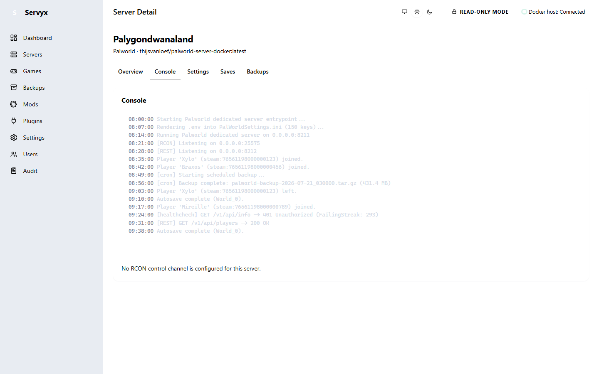

# The RCON console

A server's **Console** tab has two halves: a streaming log view (see [Console and logs](console-and-logs.md)) and, below it, a command panel that talks to the game over RCON. This page covers the command panel — what it lets you do, why it's shaped the way it is, and how to read it when RCON can't be reached.

## A catalogued console, not a shell

The command panel is a `<select>` of command ids the server's definition declares — never a text box you type a command line into:

The set of commands available is per-game: each definition under `definitions/` declares its own catalogue under `control.channels[].commands`, each with its own `readOnly` flag — a Minecraft server's panel offers `save-all`/`stop`/`kick`, not Palworld's `ShowPlayers`/`BanPlayer`. Using Palworld as the worked example, every command Servyx can send to a Palworld server is declared in `definitions/palworld-docker.yaml`:

| Command | Template | `readOnly` |
|---|---|---|
| `info` | `Info` | `true` |
| `players` | `ShowPlayers` | `true` |
| `save` | `Save` | `false` |
| `broadcast` | `Broadcast {message}` | `false` |
| `kick` | `KickPlayer {playerUid}` | `false` |
| `ban` | `BanPlayer {playerUid}` | `false` |
| `shutdown` | `Shutdown {seconds} "{message}"` | `false` |
| `doexit` | `DoExit` | `false` |

That `readOnly` flag — not the command's verb, not its RCON packet, not anything about the wire protocol — is what Servyx's write guard (`WriteGuardedRconSession`) gates on. A raw Docker `exec` or a Source RCON `SERVERDATA_EXECCOMMAND` packet looks identical on the wire whether it carries `Info` or `Shutdown`; only the definition's declared intent tells Servyx which is which. Picking a command from the list fills in typed argument fields for any `{placeholder}` the template declares (for example `message` for `broadcast`), so you can't accidentally reshape the command itself — only fill in its blanks.

There is deliberately no free-text command box. `IRconSession` does expose a `SendRawAsync` escape hatch for an arbitrary, operator-authored line, but the Console tab never calls it, and it would refuse anyway even if something did: `WriteGuardedRconSession.SendRawAsync` treats a raw line as mutating unconditionally (a string with no declared `readOnly` flag can't be classified as safe) and refuses it unless the server's write mode is already `Enabled`. Underneath that, both reachability paths — `direct-tcp` via `RconSession` and `docker-exec-tool` via `DockerExecToolRconSession` — require a configured `IRconAuditSink`. The composition root wires none (`Program.cs` passes `audit: null` when it builds the RCON channel set), because an unaudited arbitrary-command channel is exactly the kind of unreviewable surface Servyx does not ship. The catalogue is the whole interface.

## Read-only vs. mutating commands

`info` and `players` work as soon as a server has a reachable RCON session, regardless of the server's write mode — they observe the server and change nothing, so read-only mode still answers "is it up?" and "who's connected?".

Every other command requires the server's write mode to be `WriteMode.Enabled` (see [Enabling writes](enabling-writes.md)), and even then the panel makes you confirm in a second, separate step: choosing a mutating command and pressing **Send** doesn't invoke anything yet — it swaps the button for a "Nothing has been sent yet" confirmation with its own **Yes, send it** control. Only that second click calls `IRconSession.InvokeAsync`. If the write mode isn't `Enabled`, the attempt still reaches the guard and comes back as a refusal naming the command, the server, and the required mode — not a silent no-op.

## Reachability: how Servyx actually gets to RCON

Before any command can be classified and sent, Servyx has to reach the RCON port at all — and on the bundled `thijsvanloef/palworld-server-docker` image, that's not a given. The definition declares an ordered list of strategies, and Servyx tries each in turn until one works:

1. **`direct-tcp`** — connect straight to the RCON port on the host network. This is tried first, but on the bundled image it can't succeed: the container's RCON port is declared `published: false`, so nothing on the host network side of the port is actually listening for a direct connection to accept.
2. **`docker-exec-tool`** — run the image's bundled `rcon-cli` *inside* the container via `docker exec`, over the same execution channel Servyx already uses for Docker lifecycle operations on that host. Because this runs inside the container's own network namespace, it reaches the port regardless of whether it's published outward. This is the strategy that actually works against the bundled image.
3. **`docker-exec-network`** — reaching the port from a sibling container on the same Docker network. The definition names this strategy, but Servyx doesn't implement it yet at this milestone; it reports itself unavailable with a fixed explanation rather than disappearing from the list.

**`docker-exec-tool` only exists when Servyx has somewhere to run `docker exec`.** It needs an `IExecutionTarget` — in practice, a configured `ssh+docker` host (see [Connecting a host](connecting-a-host.md)). With no such host configured, the chain simply omits that strategy rather than registering one that could never succeed, so it degrades to `[direct-tcp, docker-exec-network]`.

## Diagnosing a failure

When no strategy in the chain succeeds, Servyx raises `RconUnreachableException` naming **every strategy it tried and why**, and the Console tab renders that message verbatim rather than a generic "RCON failed":

- `direct-tcp` reports the raw socket-level failure — for example a TCP connect failure carrying the underlying `SocketErrorCode`, or that the probe timed out waiting for the port to accept a connection.
- `docker-exec-tool` reports the probe's own exit code — its `IsAvailableAsync` runs `which rcon-cli` inside the container first, and a failure there is reported as `probe 'which rcon-cli' exited <code>` (plus a truncated excerpt of the probe's stderr, when there was one).
- `docker-exec-network` always reports itself unavailable with the same fixed, declared reason, since Servyx hasn't implemented it yet.

The demonstration host configures no RCON channel for either seeded server at all, so the panel shows a different, earlier message instead — "no channel configured" is a distinct state from "configured but unreachable" (see [Diagnostics](diagnostics.md) for the full breakdown of that distinction):

## Where the RCON password comes from

The command panel never asks you for a password. Each server's RCON credential is a locator, not a value: Servyx derives a secret URN from that server's own configuration key — of the shape `secret://server/<server-key>/rcon/password` — and resolves the actual bytes through the secret store only at the moment a command is sent (see [Secrets](secrets.md) for how that store masks and protects values generally). The definition file's own `passwordRef: "secret:admin-password"` field is descriptive of intent, not something Servyx parses to locate the credential — the composition root builds the real URN itself, from `Servyx:Servers:<key>:Rcon:*` configuration, so the credential's location is never dictated by content read out of a definition file.

---
**See also:** [Console and logs](console-and-logs.md) · [Diagnostics](diagnostics.md) · [Enabling writes](enabling-writes.md) · [Connecting a host](connecting-a-host.md)
