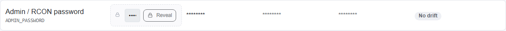

# Secrets

## Which fields are treated as secret

A game definition marks individual settings with `type: secret` — for Palworld this covers fields such as the admin password and server password. A setting marked this way is never allowed to carry a literal default value in the definition itself; its value always comes from Servyx's own secret store, never from checked-in content.

## Masking

Any column that could carry a secret-typed setting's real value — Desired, Authoritative, Rendered, Runtime — is masked at the point Servyx reads it, before it is handed to anything that renders it. A masked value shows as a fixed placeholder (`********`) rather than the real text.

This is a deliberate, structural choice, not a UI styling detail: masking a value only in the browser (for example, using a password-style input) hides it visually but leaves the real value sitting in the page's markup, where "view source," an accessibility tool, or a screenshot can still expose it. Servyx masks the value itself, at read time, so there is nothing unmasked to leak regardless of how a page happens to render it. The same masking is meant to apply everywhere a secret could otherwise surface — console output, logs, audit records, and diffs — not just the settings table.

## Reveal, and who may do it

The settings table includes a **Reveal** control next to secret-typed fields. In the current milestone this control is locked along with every other mutating or sensitive action — Servyx has no identity or role system yet (the Users page is a placeholder; see [Troubleshooting](troubleshooting.md)), so there is no one today the dashboard can attribute a reveal action to. Treat Reveal as a preview of a future control, not something you can use yet.

## Storage: ASP.NET Data Protection

Servyx's secret store encrypts each secret with ASP.NET Core's Data Protection, using a file-backed key ring. Each secret is one file on disk holding a small JSON envelope whose only secret-derived content is ciphertext; the key ring itself lives in a separate directory so it can be backed up or rotated independently of the secrets it protects.

**What this means for backing up Servyx's own state:** the ciphertext files are useless without the key ring that encrypted them. If you back up Servyx's data directory, back up the key ring alongside the secret files — losing the key ring while keeping the ciphertext makes every stored secret permanently unrecoverable. See [Installation](installation.md) for the default paths.

## Secrets in `.env` files on the host

Servyx's secret store is separate from whatever secrets already live in plain text inside a server's own `.env` file on the host — Servyx reads and masks those values for display, but the file itself remains exactly as plain-text as it always was outside Servyx. Mirroring `.env`-held credentials into Servyx's own secret store is a design question the project hasn't settled yet (see the roadmap's open questions); for now, treat the host's `.env` file as carrying its own credentials with its own file permissions, independent of anything Servyx masks in the UI.

---
**Next:** [Backups and saves](backups-and-saves.md) · **See also:** [Connectors — Secrets and host key trust](../connectors.md)
