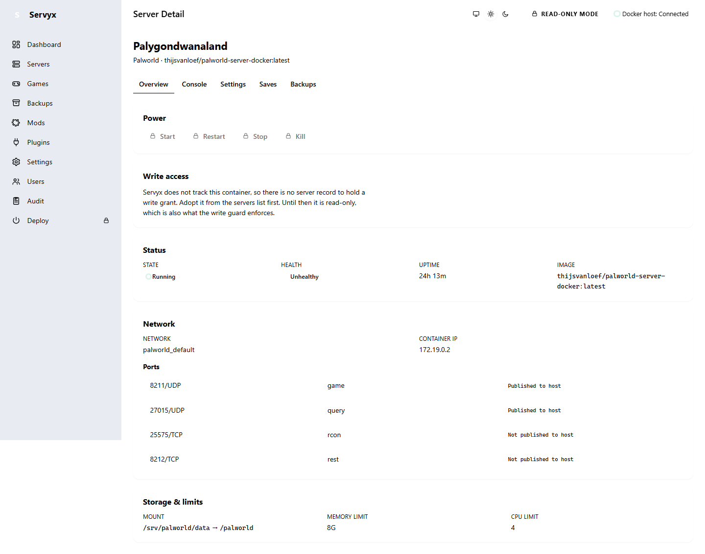

# Troubleshooting

## "Health says unhealthy but players are online"

This is expected, not a fault, for the standard Palworld Docker image. Its built-in healthcheck calls an API endpoint without supplying admin credentials, so every single check comes back `401 Unauthorized`, and Docker reports the container as unhealthy — while the game itself runs normally and players connect without issue. Servyx deliberately does **not** derive the server's own readiness from Docker's health status for this exact reason; it shows Docker health as a separate, clearly labelled signal rather than folding it into the server's actual running state. Check the Console tab for repeated `401 Unauthorized` lines around the same time as the unhealthy badge — that combination confirms this case. See [Console and logs](console-and-logs.md) and [Architecture — Readiness vs. Container Health](../architecture.md).

## "Every button is disabled"

This is the current milestone working as designed, not a bug or a permissions problem on your end. Servyx's present milestone is strictly read-only: every mutating control — power actions, settings fields, the console command box — is locked, with the same explanation wherever you find it: *"Servyx is in read-only mode. Writes are enabled per-server in Milestone 4."* Nothing you configure today changes this; writes arrive in a future milestone. See [Control tiers](control-tiers.md).

## "The host will not connect"

Check what Servyx is actually configured to reach. By default it talks to the local Docker engine (the standard socket on Linux, the Docker Desktop named pipe on Windows); a remote engine requires an explicit `tcp://` endpoint or the `DOCKER_HOST` environment variable, set before Servyx starts. If Docker itself isn't running or isn't reachable at that endpoint, no server list will populate, and the pages will show their empty states rather than an error — that absence of any adopted server is often the only visible symptom. See [Connecting a host](connecting-a-host.md).

## "The SSH host key changed"

Do not simply accept the new key to make the warning go away. Servyx treats a changed host key as a security event: the connector is evicted immediately and every operation against it halts until you explicitly re-pin. Before re-pinning, confirm the new fingerprint against an independent source — the host provider's console, or a fingerprint you saved when you first built the box — the same way you verified it on first connection. A changed key is often an innocent host rebuild, but the whole point of pinning is that you don't get to assume that without checking. See [Connecting a host — Host-key trust](connecting-a-host.md#host-key-trust-tofu).

## "A setting I changed reverted"

You very likely edited the wrong file. If the setting lives in a file the game's own entrypoint regenerates on every boot — `PalWorldSettings.ini`, for the standard Palworld image — any direct edit to that file is silently overwritten the next time the container starts. That file is a **derived** surface, not a place to express your intent; the authoritative source is `.env` (or the equivalent for your deployment). See [Configuration](configuration.md) for the full four-column model and why this file in particular is the classic trap.

## "Servyx cannot see my container"

Adoption requires **both** of two conditions to hold, not just one: the container's image repository must match what the game definition expects (the tag is ignored, so `:latest` vs `:v1.2` doesn't matter), and the container must have a mount whose *container-side* path matches what the definition expects (`/palworld`, for the bundled Palworld definition). A container running the right image but mounted at a different internal path — or vice versa — will not be proposed as a match. Check both independently before assuming discovery is broken. See [Adopting servers](adopting-servers.md).

---
**Next:** [Back to the guide hub](index.md) · **See also:** [Roadmap](../roadmap.md)
